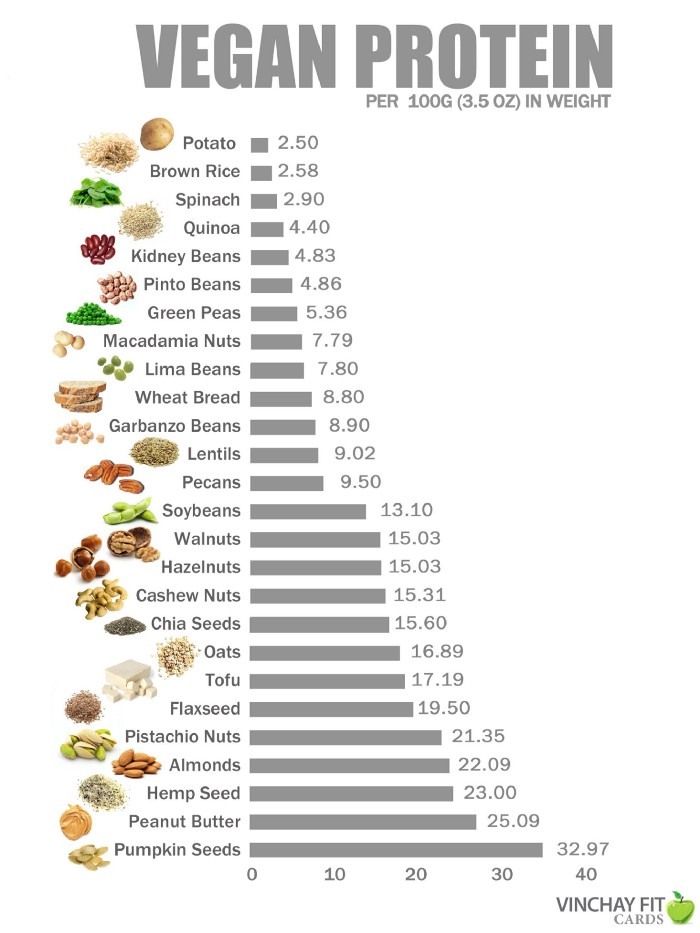

I’m sure that every one of you has met a vegan who you would consider “preachy” or “pushy”. Maybe some of you may consider me as that person? I’ve been following a predominantly vegan diet for 2 years and love it. Yes, I feel passionate about the reasons that I'm vegan and yes, I think that more people should be vegan, however, I try not to bring it up in every conversation. I’m going to look at whether a vegan diet can be suitable for everyone.

## Affordability

One argument that is commonly brought up is the cost of a vegan diet. Whilst I agree that the majority of branded vegan replacements (ie vegan cheese, vegan meat) are expensive, there is definitely an affordable way to eat predominantly plant-based. Consider fruit, vegetables, beans, legumes, lentils, pasta and rice. These foods are some of the cheapest things to buy in the supermarket and are all vegan. With this, you could make a [lentil bolognese](https://www.veganricha.com/lentil-bolognese-with-spaghetti/). Let’s compare this to a beef bolognese, where the only difference is the protein source. Lentils cost £1 for a bag (serves 4), whereas beef mince costs roughly £3 for a pack (serves 4). The recipe linked [here](https://www.veganricha.com/lentil-bolognese-with-spaghetti/) also takes only 35minutes to make. There are so many affordable swaps like this that prove that there is a cheaper side to Veganism.

## Convenience

Okay, so I hear you saying ‘that’s only one meal’ or ‘that’s a bit too complex’. So, here are 5 simple vegan meals that are affordable, healthy and quick to make:

[30-minute One-pot Mushroom Curry](https://www.bbcgoodfood.com/recipes/one-pot-mushroom-potato-curry)

[40-minute Vegan Burritos](https://www.bbcgoodfood.com/recipes/vegan-burritos)

[20-minute One-pot Spicy Rice](https://www.bbcgoodfood.com/recipes/one-pan-spicy-rice)

[20-minute Vegetable Ramen](https://www.olivemagazine.com/recipes/vegan/miso-shiitake-ramen/)

[15-minute Falafel Burgers](https://www.bbcgoodfood.com/recipes/falafel-burgers-0)

Don’t get me wrong, there are a ton of non-vegan foods that are a lot more convenient than the vegan equivalent. A chicken nuggets and chips meal, for example. However, with increasing demand for vegan food, the prices are going down. Most of the big supermarkets have vegan equivalents of fast foods like fish fingers, minced meat, ‘chicken’ nuggets, pizza and burgers. And not forgetting that foods like chips, wedges, potato waffles and crisps are usually vegan. Here’s a guide to loads of [accidentally vegan foods like this!](https://www.veganfoodandliving.com/features/accidentally-vegan-products-you-can-find-in-supermarkets/)

## Moderation

I believe strongly in moderation. Not just in the way I eat, but in exercise, work, relaxation, alone time and pretty much everything in life. Specifically, in regards to Veganism, I feel that eating a majority of vegan foods is much better than not eating vegan at all. Instead of completely going cold turkey, I would encourage people to have one vegan day a week, reduce their meat intake or cut out dairy or eggs. All of these small changes have a huge impact. This is the reason why I don't beat myself up if I slip up on a non-vegan product, or if I eat a little bit of something on a bad day. When you’re eating mostly vegan, you’re still making a difference, increasing demand for vegan products, helping the environment and animal welfare.

## Specific Dietary Needs

Another argument against Veganism that I have seen recently is that the variety of dietary requirements out there make it harder for some people to stick to a completely vegan diet. It is in these cases that I would, again, lean towards moderation. A friend of mine is a vegan and also suffers from gluten intolerance. If anyone else here is gluten intolerant or coeliac, you will know that most gluten-free bread contains eggs. In this case, my personal opinion is to be more relaxed. Where you can, eat less meat, dairy and eggs and, in the circumstances where you cant, relax it. After all, as I previously said, all of the changes you make are all having a positive impact.

## Protein & Nutrients

But what about the protein? You might get low iron? I heard you can only get vitamin B12 from animal products? Where do you get your calcium from? All of these questions are things that people ask consistently.

Above, you can see a graph with the amounts of protein in vegan foods. You can see that there is high amounts of protein in a lot of these foods. To compare with chicken, for example, 100g of chicken has approximately 30g protein in. So, whilst this is higher than most of these foods, you can get a similar amount of protein from 150g Tofu or Oats. Furthermore, there are so many vegan protein powders around now, containing a mixture of proteins to make it a complete source of protein. On Amazon, you will find plenty of affordable ones (although I will give it to you, they often don’t taste as good). If you’re interested in this, the[Game Changers Movie](https://gamechangersmovie.com/)is a great start at looking into Veganism in the world of sport.

In regards to Calcium, Iron and B12, many vegan foods are fortified to provide these ingredients. You can find calcium and iron in plant milk, soybeans, tofu, spinach and bread. Often, there is actually more calcium in a cup of soy milk (200–400mg) than in a cup of dairy milk (300mg). Most of the adverts claiming that the best source of calcium is from dairy are actually made by companies funded by farmers or people with a vested interest in the dairy industry. B12 is a substance usually found in the soil and animals consume this from the soil, which is how we get it from animal products. However, due to recent agricultural methods, B12 isn’t found much in the soil any more and, so, farmers are supplementing their animals with it.

## Reasons to be vegan

I thought I’d put this at the bottom, so it doesn't come across ‘pushy’ and ‘preachy’. In case you're interested, these are the reasons that I am vegan and some reasons why you might consider reducing your animal product intake as well.

### Health

I originally became vegan due to health reasons. I wanted to have a healthier diet, lower in saturated fats. Also, as a sufferer of IBS and eczema, I realised that dairy was causing many flare-ups. Once I started cutting out animal products, I found a great improvement in the symptoms of these and, so continued on the vegan path. Very few vegan foods contain saturated fats and so, it’s a great diet to help lower your intake.

Check out [What the health](https://www.whatthehealthfilm.com/) on Netflix for more on this.

### Environment

The next main reason was the environment. Through scuba diving and travelling, I saw the huge impact that pollution was having on the environment. Becoming vegan is the single biggest way to reduce your environmental impact. A study from Oxford University found that, if everyone cut out meat and dairy, greenhouse emissions would cut by 49% and a 76% reduction in the amount of land used for food production. Think about it, you're cutting a whole stage out of the food chain!

Check out [Cowspiracy](https://www.cowspiracy.com/about) on Netflix for more on this.

### Animal Welfare

This is my final reason. I never really considered the welfare impact until I had been vegan for about 6 months. Documentaries such as [Dominion](https://www.dominionmovement.com/) truly showed me another side to the ‘happy cows and happy farms’ image that we have been sold since we were children. I don’t doubt that some farmers treat their animals well but I believe they are the minority. Furthermore, I don't feel that you can care for animals if you are artificially inseminating them against their will, taking newborn babies from their mothers, killing animals at less than a quarter of their lifespan and force-feeding animals to make them ‘meatier’.

Another documentary that I haven't watched, but has good reviews, is [Earthlings](http://www.nationearth.com/).

So, in conclusion, I believe that everyone should be reducing their meat intake. I appreciate that it will be extremely hard for many people to completely cut out animal products, however, there is a multitude of reasons for reducing your intake of animal products. Some of you may not have the same feelings towards the welfare of animals as I do and so I would encourage you to look at the environmental or health impact. If you can have 3 vegan days a week, the impact is still huge.

Start small, after all a small change is better than no change.