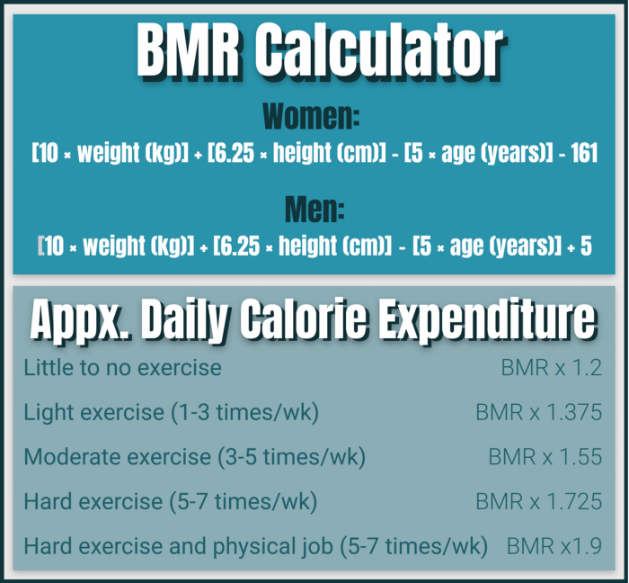
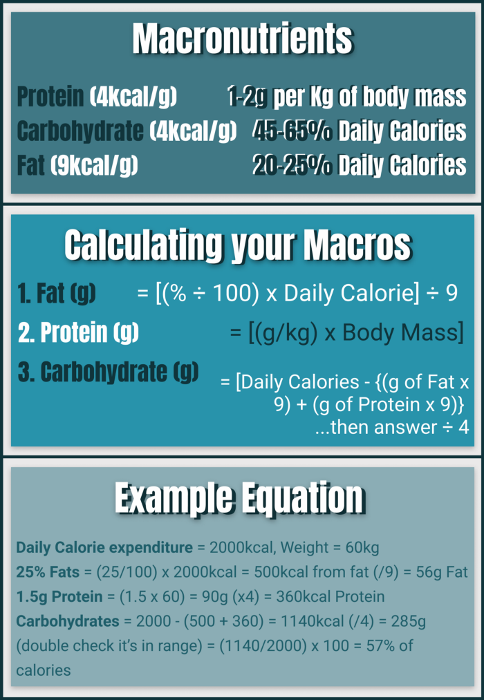

A healthy diet is just as important as exercise is in reaching your goals. Everyone will tell you this, but there is so much conflicting advice on how to structure your diet. I’m going to go through some common methods of tracking your food intake and break down some myths about nutrition.

The most important point that I want to push is that everyone is individual and a diet should reflect that. There is no ‘one size fits all’ for nutrition and it takes a bit of tweaking to get a diet that works for you. Here are some general nutrition tips that may help you along the way.

## Tracking

The first step in working out how much you should be eating is tracking your macronutrient intake. Macronutrients (aka macros) are the 3 main food groups in your diet; Carbohydrate, Fats and Protein. Every person will have a different ratio of these food groups depending on your exercise level, body type and metabolism.

The first step in working out how much you should be eating is to work out your approximate daily calorie needs. Your BMR, also known as your basal metabolic rate, is the amount of calories that your body needs if you were not moving around at all, all day (see below). For example, if you were sitting still in bed.

To calculate your daily calorie expenditure, you need to multiply this BMR by a number, dependant on your physical activity level (see below). This number will be the number of calories that you need to consume each day to maintain your current body weight.

Within your daily calories, you should eat the right proportion of protein to fats and carbohydrates. This will be relative for each person and will take some trial and error to find out what works for you.

## Protein

There’s so much hype about protein in the fitness industry, and rightly so. Protein is key in repairing and building muscle in your body. It is important to note that eating a diet high in protein will not make you muscular and ‘big’. For men, it helps to have plenty of protein, if your goal is muscle growth, however ,you will still need to work in the correct way to allow for muscle growth [\[see here]](https://medium.com/@beccastevens_84388/train-for-your-goals-building-a-workout-especially-for-you-f1bcdf3e02dc).

In women, without steroids or other mass building supplements, you won’t become ‘big’. You may tone up and have more definition, however, it is not in your genetics to grow muscle to the same extent as men. Protein is an important part of the diet and everyone needs it, regardless of their physique goals. There is no need to worry, as many women do (I used to) about protein or muscle gain radically changing your body shape.

As someone who is exercising regularly, the guidelines suggest between 1–2g of protein per kg that you weigh. So, if someone weighed 65kg, they should aim for between 65–130g of protein per day. Every gram of protein contains 4kcal of energy.

## Carbohydrates

Carbohydrates are important in every diet. They are a source of energy, used to store energy, regulate blood sugars and spare fats and protein for use elsewhere in the body. You should consume 45–65% of your daily calories from carbohydrate. This should fit in with the amount of protein and fats you are eating to ensure you are sticking to your calorie goals. Each gram of carbohydrate contains 4kcal of energy.

It could also be beneficial to stick to low Glycaemic Index (GI) carbohydrates, such as wholemeal bread, brown rice or oats. This is because low GI foods prevent blood sugar spikes and ensure that the energy is released slowly to provide throughout the day. High GI foods may be beneficial for as an immediate source of carbohydrate, for a quick burst of energy, if needed throughout the day.

## Fats

Fat is an important part of the diet and helps in many processes such as the absorption of fat-soluble vitamins or forming cell membranes. It is important to note to highlight that the consumption of fats will not make you ‘fat’. Fats are essential for everyone, however, the type of fat is extremely important. Saturated fats are the unhealthier fats, which can build up the cholesterol level in your blood. They are found in foods such as:

* Butter
* Dairy products
* Deep-fried foods
* Eggs

Unsaturated fats are much healthier than these, and can lower the levels of cholesterol in your blood. These types of fats are found in

* Seeds
* Nuts
* Oily Fish
* Olive Oil

You should eat approximately 20–25% of your daily calorie intake from fats.

## Calculating approximate macros

The image below shows how you can calculate your macronutrient intake. I strongly recommend that you don’t use this as a really strict format and more of a guideline into a healthy eating pattern for you.

As long as you’re tracking the majority of your foods, you don’t need to obsess over the minor intakes such as milk in your tea or a few crisps from your mates’ bag. It’s important to have a good perspective, understand your general daily needs and work roughly from there. I would recommend tracking for a week or so, to understand portion sizes more clearly and have greater nutritional knowledge about the foods you are eating. However, after understanding this, you will have a better general idea about what to eat and whether or not tracking long term works for you.