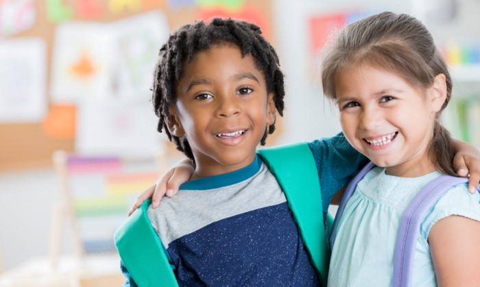
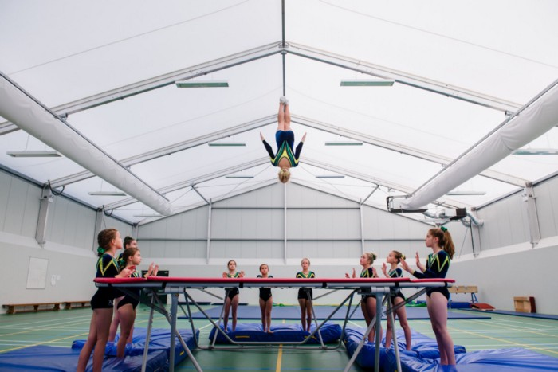
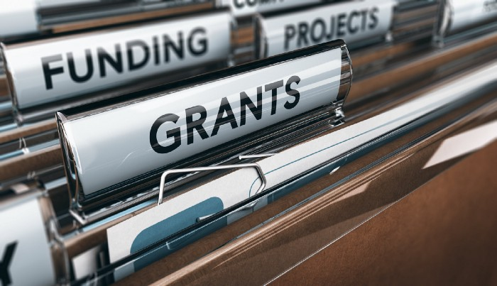
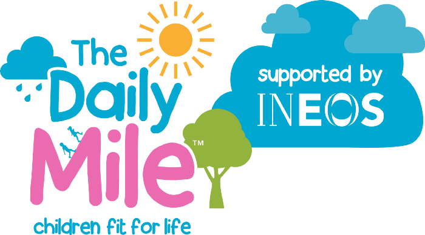

Although I love to exercise and stay active now, when I think back to school Physical Education (PE), it traumatizes me. I remember being the last one to be picked for a team sport, the overwhelming competitiveness, being forced to wear shorts and a t-shirt in all weathers and a considerable lack of different sports options. If anything, all that PE did was give me a hatred for sport. And, I’m not an exception.

The Women's Health and Fitness Association found that over half of secondary school girls say that they have been put off sport through their experiences I school PE. The teachers’ preference for talented individuals was clearly evident and a strong deterrence for the less sporty or non-mainstream sport orientated individuals.

Surely, the goal of school PE is to ensure that all young people are staying active, keeping fit and having fun whilst doing it? So, what is it that is causing PE class to be anything but enjoyable, for the majority of its participants?

## Sexist?

In school, sports classes are predominantly separated into male and female classes, an extremely discriminative process. At my school, and I know this happens at a large number of other schools, the boys did certain sports and the girls did other sports. For example, as a girl, I never had the opportunity to do football, rugby or cricket. My male friends, however, got to do these sports but never tried netball, rounders or lacrosse. Why should your gender determine what sport you should participate in? The government requires that both genders should be exposed to the same options in PE, although they are allowed to be separated. However, this is clearly not happening, as PE teachers frequently push children towards their “gender-specific” sport.

The distinction between is genders blurring. There is no longer only two genders, which means that categorising into two gender groups is discriminative. It could make non-gender-conforming students feel uncomfortable having to workout in a class of gender which they do not feel like they belong in. Although some people may argue that girls may feel uncomfortable doing sport with boys, this is the exact issue that separated PE lessons causes. Separating the genders portrays a difference in capability between girls and boys which is far from the truth.

Both women and men are capable of competing in all sports at similar levels. In some sports, due to physical differences, one gender may perform better than the other. However, in recreational PE classes, this gender difference is unlikely to have an effect within the already age classified classes. It is more likely to reinforce the stereotype that women are unambiguously weaker and less capable than men. Is this an idea that we should be teaching children in school?

## Lack of choice?

Throughout the coronavirus pandemic, we’ve all seen different people of all ages getting active, especially through Joe Wickes hugely successful daily PE classes. Children seem to be loving the fitness-based PE lessons, and yet fitness-based PE is not a key part of the PE curriculum, with competitive sport taking priority. Whilst I agree that it is important to allow children to try a variety of sports, it is important, once they reach a certain age, to give them a choice.

More often than not, the choices that children are given are often limited to very ‘traditional’ sports. These include rugby, cricket, football, netball and lacrosse. It may be more beneficial to introduce newer, exciting options that will motivate children to become active, such as gymnastics, trampolining, table tennis, fitness, cycling, karate and boxing. Although traditional sports are important, by providing a selection of different sports allows all children to have a chance to find a sport that they enjoy. For some children, school is the only chance that they have to try sports, for financial or other reasons and so it is important to provide equal opportunities.

## Funding

Although I appreciate that many schools lack the facilities to provide lots of options, the government should ensure that there are at least a few options within each school, through increased funding. By putting more funding into PE, it will have a positive impact in the future. More people will be staying healthy and keeping fit, putting less strain on the NHS. Furthermore, children who are involved in sports and enjoying sports and more likely to pursue this outside of school and so less likely to be involved in [antisocial behaviours](https://repository.cardiffmet.ac.uk/handle/10369/6985). Both the NHS and antisocial behaviours cost the taxpayer a large amount of money. Through spending this money on increasing the quality of school PE and health education, there will be reduced cost later on in their lives.

If a wide range of choice is not a viable option, there is the potential for local schools to partner up, after-school clubs can be offered or bring in trained sporting coaches, alongside PE teachers.

## Weekly hours

Currently, there are no government requirements for how much PE children should undertake each week. They recommend a weekly allocation of 2 hours. However, given that the daily exercise recommendation for children aged 5–17 is 60 minutes per day, this recommendation seems extremely low. For children who don't engage in sport outside of school and have a relatively sedentary home life, this PE allocation in school is providing them a mere 17 minutes of exercise per day (average). Could this be the cause of the rising obesity rate in children?

Given this data, surely it would be beneficial to have more structured exercise sessions for children. Some schools have started introducing daily fitness into their timetable such as ‘the daily mile’ in which students run or jog for 15 minutes per day. These programmes are hugely successful and backed by scientific [evidence](https://thedailymile.co.uk/research/). By doing this exercise at the beginning of the day, it helps children to focus, improves their cognition and improves mood. This will enhance the learning environment.

## Summary

Overall, it is evident that PE is not providing the opportunities that it could. Whilst it is great for those students with opportunities to undertake sport outside of school, or those with natural talent, it is failing many of its students. With the [growing childhood obesity epidemic](https://www.who.int/dietphysicalactivity/childhood/en/), it is important to provide good quality physical education for students. There should be a focus on both sport and fitness, with a variety of options available to encourage finding a sport that each person enjoyed. Classes should be mixed gender, perhaps separated loosely by age. Where possible, it may be beneficial to have classes of different abilities, to reassure all pupils to try and enjoy sports, regardless of ability.
