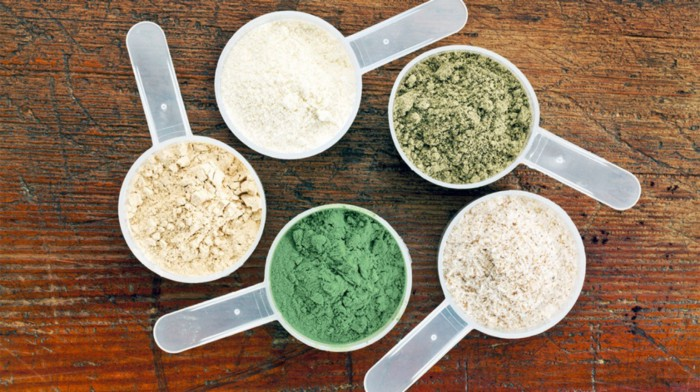
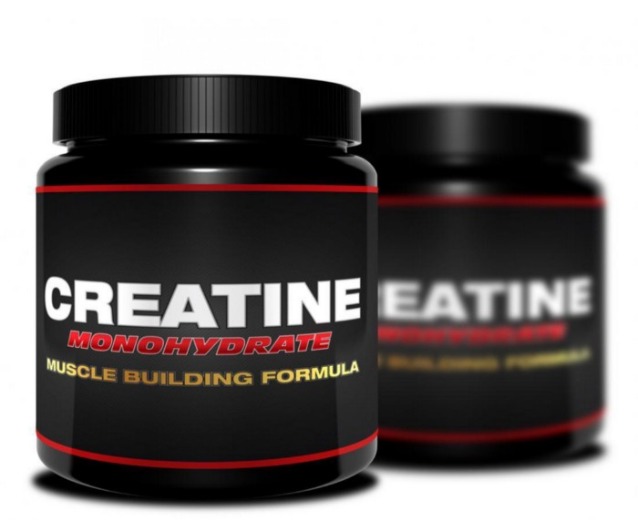
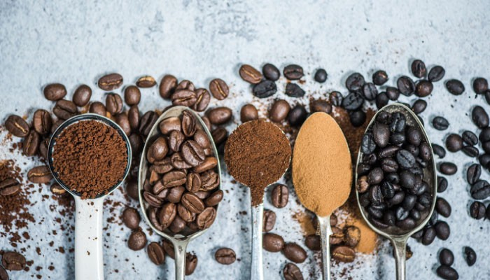

All over the internet, various sources will recommend all kinds of supplements to ‘supposedly’ improve your athletic performance or help you lose weight. From deer antler velvet to beetroot juice, every site will swear by different products. With so much incorrect information online and so many companies trying to sell the latest fad, how can you know which supplements will be worth your money? I’ve summarised some current research (references at the bottom) and picked the 3 best, research-backed supplements.

## Protein

### What is it?

Protein is a key macronutrient used in the body for growth and repair of muscles. When we exercise, our muscle gets broken down. In order to build muscle, we must have enough protein in the body. This protein comes from the food we eat.

### Who is it for?

Everyone! All people need protein and, even if you're not exercising, muscles will still undergo growth and repair. Most non-exercisers consume enough protein, even through eating a vegan and vegetarian diet. However, if you're exercising regularly, it may be beneficial to supplement your diet with a powder or bar.

### How much to take?

For the average person, 0.8g/kg of body mass is perfectly adequate. For strength and endurance athletes, 1.3–1.8g/kg of body mass is more suitable. This is because due to the amount and intensity of training, more muscle is broken down and so more protein is required to repair this and grow more. Most protein powders come with a scoop measurement and the average serving provides 20–25g protein. Alternatively, you can definitely get all the protein that you need through your diet. As a vegan, I get a lot of protein from beans, lentils, chickpea flour, [seitan](https://www.thebuddhistchef.com/recipe/seitan/) and soy (ie tofu).

## Creatine

### What is it?

Creatine is a substance that is found naturally in muscle cells and is used in the muscles to produce more ATP, a molecule which generates energy. This is specifically in high-intensity exercise and heavy lifting.

It has been suggested that creatine supplementation can reduce the range of motion of various parts of the body, leading to muscle stiffness and resistance to stretching. Drinking lots of water while taking creatine could minimise this.

### Who is it for?

Creatine is ideal for anyone participating in high intensity, intermittent activity such as sprinting, weightlifting, bodybuilders, powerlifters, cycle sprinters etc.

### Suggestions for how it works:

* It maintains the phosphocreatine stores in the body so that ATP (a molecule that releases energy) can be generated during intense exercise
* Speeds up the process of phosphocreatine being re-made after exercise.
* Slows down the process of certain protein builders breaking down (adenine nucleotides)
* Slows down the lactate build-up (slows the muscle burn)
* Enhances glycogen storage in muscles (more energy for movement)

Creatine has the support of multiple clinical trials, supporting its use as a sports supplement.

### How much to take?

Around 3–6g per day is recommended, although different studies have used it in different amounts. A general guide for constant use over time, although a wide range, is 0.03–0.1 g per kg of your body weight.

## Caffeine

### Who is it for?

Caffeine is well suited to endurance athletes or long-duration activities, who need energy over a longer period of time. It can also benefit athletes who need large amounts of power. It has been suggested that caffeine has the most performance-enhancing benefits in highly trained athletes.

### How does it work?

It wakes you up, making you less physically and mentally tired. It has also been suggested that it reduces the amount of pain perceived and reduces your perceived exertion level. This means that you can put more effort into the training to feel the same level of exhaustion.

### How much to take?

2–6mg of caffeine/kg of your body mass is the amount suggested to consume before exercise. Bear in mind that the average cup of tea has around 50–75mg of caffeine in and coffee has between 100–150mg. Don’t forget other drinks that contain caffeine such as cola at 40mg per can, chocolate at 15–25mg per small bar and energy drinks at around 80mg. It has also been suggested that, if you have more than 500mg per day, it is likely to inhibit your performance. It can disturb your sleep, make you more irritable and skyrocket your anxiety.

Thanks for reading my article!

Check out my Instagram [@beccastevens98](https://www.instagram.com/beccastevens98/) or send me an email becca@traintomaintain.co.uk.

### References:

<https://www.ncbi.nlm.nih.gov/pmc/articles/PMC5756374/>

[https://ods.od.nih.gov/factsheets/ExerciseAndAthleticPerformance-HealthProfessional/](https://ods.od.nih.gov/factsheets/ExerciseAndAthleticPerformance-HealthProfessional/#beetroot)

<https://www.ncbi.nlm.nih.gov/pmc/articles/PMC6142015/>

<https://www.babycentre.co.uk/a3955/how-much-caffeine-can-i-have-in-pregnancy>