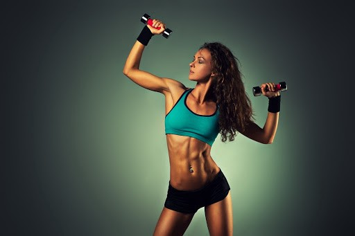
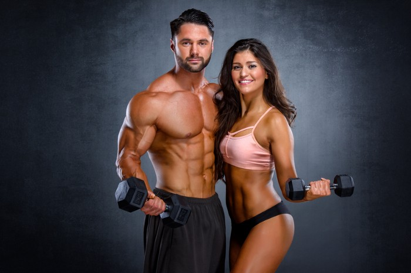
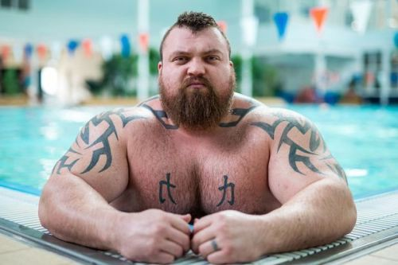

Never sure how many repetitions to do? How long should you really be resting? What weights should you be using? How do I not get too big? If you’re asking these questions, this post is probably going to help you.

Take a look around Instagram and you can find thousands of posts on different exercises to work all types of muscles, from something like your hamstrings all the way to the individual muscles in your hands. However, rarely have I seen posts on how to combine these into a workout to fit your goals. Whilst there is no general formula that can work for everyone, I’ve learned a few simple tips that should help you get the right workout for you.

## Some common goals in fitness:

- Toning Up
- Muscular Endurance
- Increasing General Fitness
- Building Muscle
- Gaining Weight
- Increasing Power and Strength

Below, I have addressed these goals and, specifically, the number of repetitions, weights (relative to individual ability) and the rest time needed to achieve these goals. As with any targets, certain factors such as specific exercises, nutrition, workout time and effort level will all have an effect on the outcome of a programme. Also, it is important to bear in mind that, if you have more than one goal, combining these workout styles will also be beneficial.

## Goal 1: Toning Up / Muscular Endurance / Increasing General Fitness

Toning up is becoming leaner through losing fat and gaining muscle. This could be suitable for someone who is overweight or simply wants to see some muscle definition. Alternatively, this style of workout is great if you want to improve your general fitness or muscular endurance.

As a side note, however, whilst some people may need to lose weight to become healthier, your weight and BMI do not always reflect your health. Muscle is much denser than fat so the same weight in muscle takes up a lot less space than fat. This means that you may tone up and become physically slimmer, however, you may not lose any weight or, in some cases, you could put on weight. To achieve toning and general fitness, you could also follow the ‘Building Muscle goal’ or a mixture of both. This is because by having more muscle in your body, your metabolism will increase. This means that you will burn more calories at rest.

However, as a general toning and improving muscular endurance goal, you would want to be aiming for a high number of repetitions at a low-medium weight. An ideal number of repetitions would be 12–15 repetitions, increasing above 15 if you feel capable. By the end of the repetitions, your muscles should feel tired and you need the rest. Increase the weight, as needed, after each set to ensure you are working to your full capacity.

On the subject of rest, a short rest is most effective for this workout style. You want to ensure that your heart rate stays relatively high and your muscles don't completely recover. This is because you are training your muscles to be able to last a long time throughout your workouts. Therefore, resting between 15–30 seconds would be perfect, allowing for a brief recovery.

## Goal 2: Building Muscle / Weight Gain

If you want to get bigger; build those leg muscles, get that booty bigger or increase your arm and shoulder size, then building muscle is the way to get there.

With each exercise you do, the number of repetitions, weight and rest-time is important. Try to aim for between 6–12 repetitions. At the end of each set, your muscles should feel tired and almost as if it would be a struggle to complete any more. To achieve this, the weight should be medium-heavy, with the last 2–3 repetitions feeling like a challenge. The rest time should ideally be between 30–60 seconds due to the levels of growth hormones in the body.

## Goal 3: Power and Strength

So you don’t necessarily care about having bigger muscles, you simply want to become strong. That's where this style of workout will come in.

It is recommended that, in training, you complete 3–5 reps in each set, again feeling the burn on the last repetition. This means that the weight should be HEAVY (all relative, of course). Another difference between training for power and muscle building is the recovery time. Ideally, between sets, you should rest for 3–5minutes. This allows for a greater number of repetitions throughout the workout so the volume can be as great as possible. With the high weight being used, it’s safer to have longer rests throughout the workout.

If you have a combined goal, feel free to mix up the workout styles. It is important to keep each workout fresh, both with the type of exercises and the workout style. This ensures that the body doesn’t adapt to the workout and it is always challenging.

## References:

De Salles, B.F., Simão, R., Miranda, F., Novaes, J. da S., Lemos, A. and Willardson, J.M. (2009). Rest interval between sets in strength training._Sports medicine (Auckland, N.Z.)_, \[online] 39(9), pp.765–77. Available at:<https://www.ncbi.nlm.nih.gov/pubmed/19691365.>

Mangine, G.T. et al (2015). The effect of training volume and intensity on improvements in muscular strength and size in resistance-trained men._Physiological Reports_, \[online] 3(8), p.e12472. Available at:<https://www.ncbi.nlm.nih.gov/pmc/articles/PMC4562558/pdf/phy20003-e12472.pdf.>

McPherron, A.C., Guo, T., Bond, N.D. and Gavrilova, O. (2013). Increasing muscle mass to improve metabolism._Adipocyte_, \[online] 2(2), pp.92–98. Available at:<https://www.ncbi.nlm.nih.gov/pmc/articles/PMC3661116/>\[Accessed 29 Oct. 2019].
