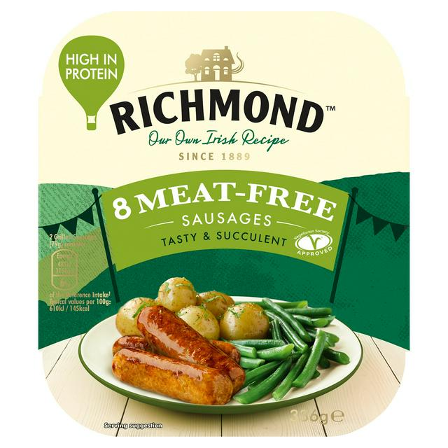
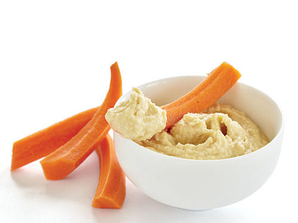
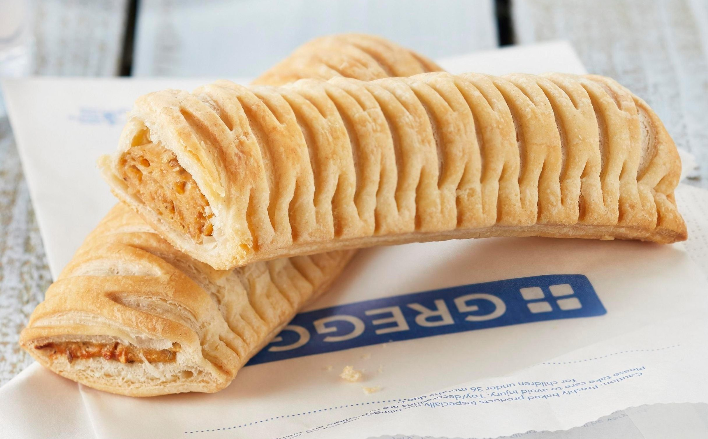
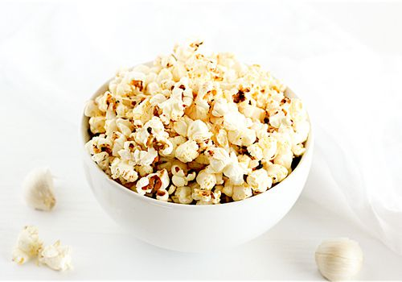
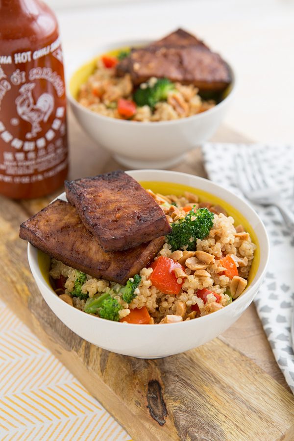
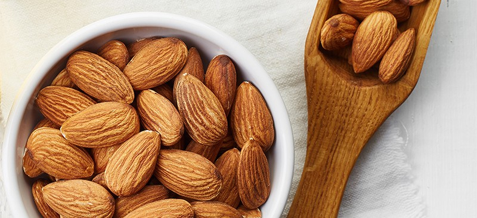

One of the most common things that is said to me when I tell people that I'm a fitness-loving vegan, is 'But what about protein?' To be honest with you, I understand the confusion. Throughout every step of our lives, we have been taught that the best way to get protein is through meat. I mean, gram for gram, it's pretty accurate. However, it is just as easy to get the correct amount of protein from a veggie or vegan diet, and I'm going to show you now!

## But how much do I really need?

Most people, meat eaters or not, will consume enough protein each day. The required amount of protein for the average person to maintain growth and repair of muscle is 0.8-1.0g/kg of body mass/day. To be put simply, for every kilogram that a person weighs, they need to be eating between 0.8g -1g of protein per day. If, for example, someone weighed 70kg, they should be eating between 64-70g of protein per day. It's actually not a lot.

## Is it the same amount if I'm exercising a lot?

Alright, I can hear the bodybuilders shouting that you need waaayy more protein than that. And, they're right. If you're working out frequently, lifting weights or have an active lifestyle, you will need more. Between 1.2-1.7g/kg/day would be plenty. So, sticking to the original 70kg individual, they would need between 77g-109g per day. For the purposes of this post, i'm going to stick to the 70kg individual and aim for 100g of protein in a day.

## How much protein is in food?

Let's consider some common foods. 2 tbsp peanut butter contains 8g of protein. Seitan (made from wheat gluten), a popular meat alternative contains about 25g protein per 100g. Alternatively, if you're a meat eater, chicken has 27g complete protein per 100g, just above Seitan.

I know this graph has been in a previous blog about a [vegan diet](https://beccastevens.co.uk/blog/2020-05-17-is-being-vegan-right-for-everyone/), but it's a really useful infographic for high protein vegan foods.

A complete protein is a protein which contains all 9 of the essential amino acids needed in the human diet. It is predominantly animal protein that contains complete proteins, although some plant proteins are complete such as quinoa and chia seeds. Although they're harder to consume through a single plant source, through eating a varied diet, it is highly likely that you will consume all the essential amino acids you need.

## So, what would a high protein day look like?

Let's get to it then. I've put together an average day of eating for someone of 70kg\*\*. Everyone needs to consume a different number of calories each day, respective to their body mass, height and activity level, so don't follow this plan exactly, but tailor it to your needs.

\*\*If you're unsure of how much to eat, I wrote a previous blog on tracking macros and whether it is right for you [(see here)](https://beccastevens.co.uk/blog/2020-05-17-should-you-track-your-daily-food-intake/).

This plan comes up to 2,000kcal, with 101g protein. I have tried to keep it relatively normal, similar to foods that I would eat on a day to day basis, to ensure that it shows how a regular person can easily reach their protein goals on a vegan diet.

### Breakfast

3 x [Richmond Vegan sausages](https://www.tesco.com/groceries/en-GB/products/304381808) in 2 slices of seeded brown bread and tomato ketchup. It's served with half a tin of baked beans. This comes in at 28g of protein.

### Snack 1

87g of low fat hummus and 1/2 cup of carrot sticks contain 10g protein!

### Lunch

A simple lunch of a greggs vegan sausage roll surprisingly has 12g protein in it!!

### Snack 2

A Banana and 1 cup popcorn with 20g nutritional yeast is 11g protein. [Nutritional yeast](https://www.hollandandbarrett.com/shop/product/engevita-yeast-flakes-b12-60009142) is a cheesy flavoured seasoning, high in protein, B vitamins and fibre!

### Dinner

[Peanutty Quinoa Bowls with Tofu](https://ohmyveggies.com/recipe-peanutty-quinoa-bowls-two-make-baked-tofu/) from Oh My Veggies for dinner. This meal is a great summery meal, with protein coming from the peanuts, quinoa and tofu. It comes in at 34g protein per serving!

### Snack 3

As dessert, or a late night snack, 1/8 cup almonds contains 4g protein alongside plenty of fibre, magnesium and vitamin E; a super healthy snack!

So, all in all, this vegan day of eating comes in at 101g Protein, more than enough for this 70kg individual. This plan doesn't include any protein supplements such as powders or bars but both of these foods can help hugely in reaching your protein goal.
