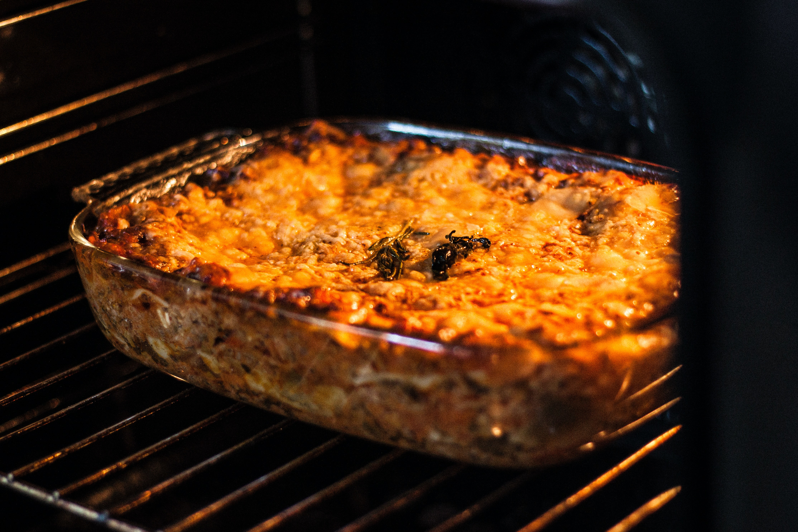
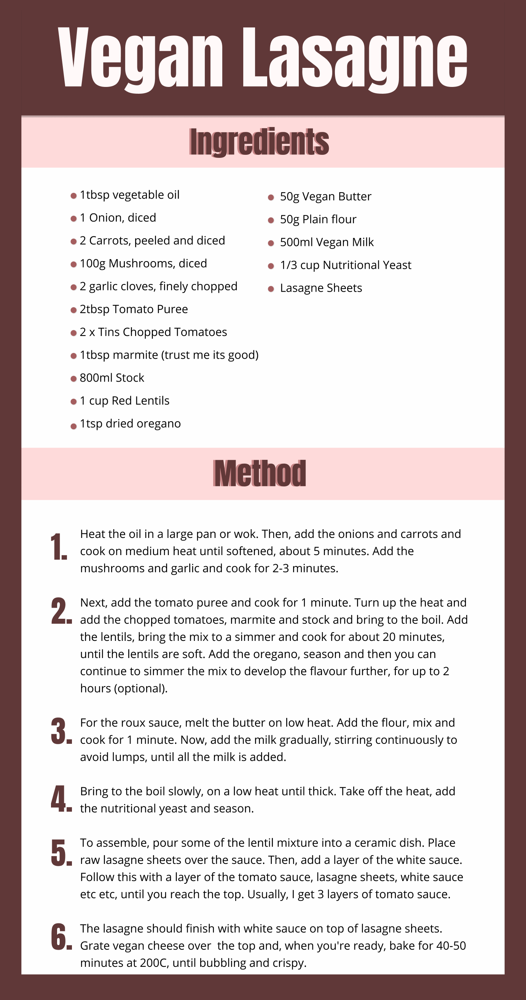
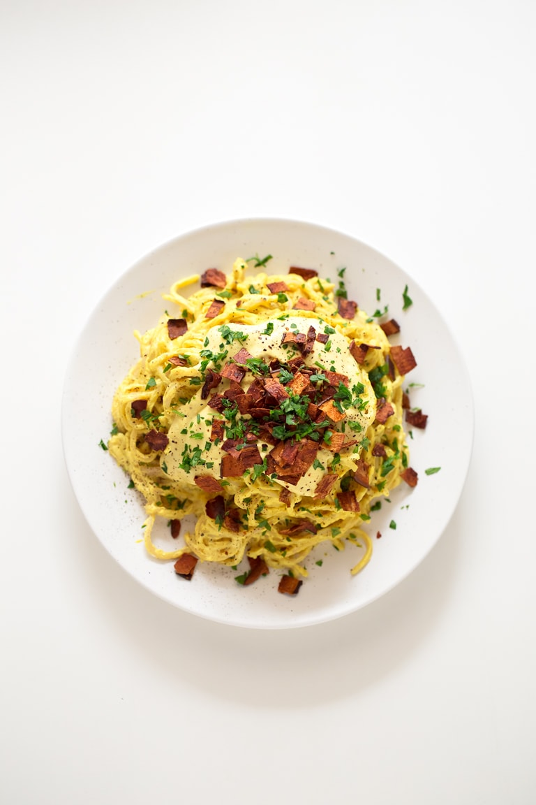
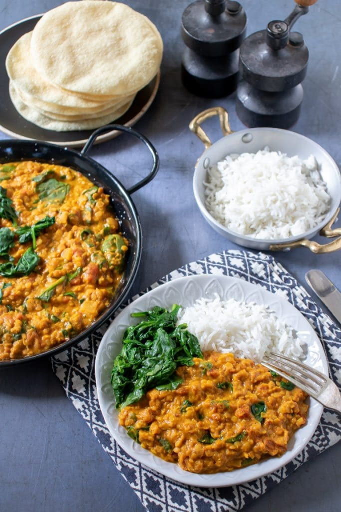
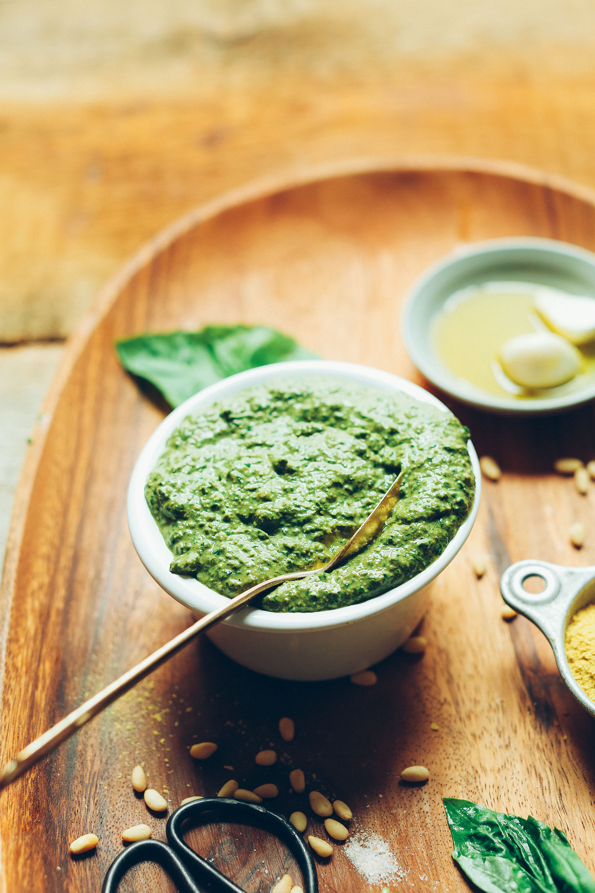
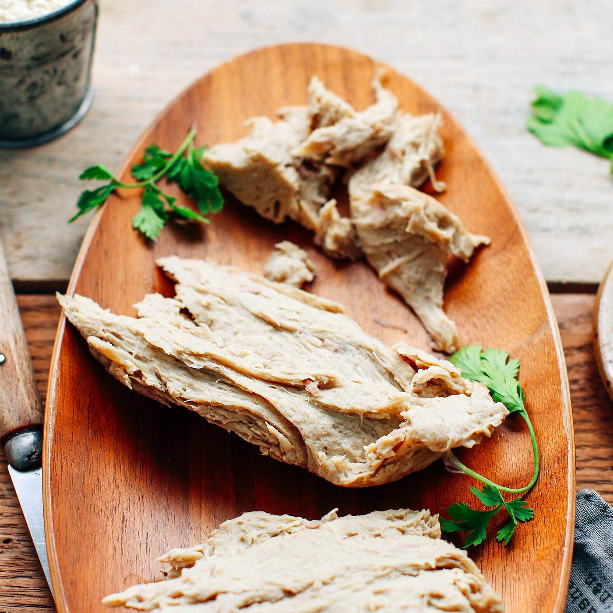

After all the love for my last vegan protein post [(see here)](https://beccastevens.co.uk/blog/2020-06-07-a-high-protein-day-of-eating-vegan-edition/), I thought I'd get down a few more simple recipes for healthy, higher protein, quick and easy vegan meals! Some of these are recipes that I have found inspiration for online, discovered at my University's vegetarian and vegan society recipe sharing events or just made up as I went along. I hope you enjoy these as much as I do!

## Lasagne

I discovered this recipe at my university Vegetarian society's recipe share event. Since then, I've tweaked the recipe slightly to make it higher in protein and more to my taste. Although it uses a fair few pans, it's a really easy recipe but is still a showstopper! This recipe should serve 4-6 people! It's great served with salad and garlic bread.

## Carbonara

[I never used to like carbonara,](https://simpleveganblog.com/vegan-pasta-carbonara/) when I wasn't a vegan. It was just way to creamy and salty for me. HOWEVER, when I made this the other day, it was nowhere near as creamy and I loved it! The tofu makes the sauce a lot less rich and super high in protein. I used a mixture of vegan bacon and smoked tofu, and it was awesome! Although, I accidentally tipped a lot of Turmeric in, so mine was a neon yellow. When you do it, I'd make sure you only add the teaspoon of turmeric that the recipe suggests!

## Lentil Daal

[This daal](https://veggiedesserts.com/red-lentil-dahl/) is one of my go to recipes. Although it only takes 20 minutes, it's so flavoursome! It goes well with roti, paratha or rice!

## Vegan Pesto

[This pesto ](https://minimalistbaker.com/easy-vegan-pesto-5-minutes/)is really quick and affordable. You can serve it on pasta, with salad or in a lasagne! I can imagine it would be great on bruscetta or with dough balls as well. If you want extra protein, you could add sausages or lentils to the pasta too!

## Vegan Seitan

Seitan (it's pronounced sate-an) is an extremely high protein meat substitute. It's not ideal for gluten intolerance sufferers or coeliacs, due to the fact that its almost 100% wheat gluten, but if you don't have these allergies, its a great addition to a meal! I have it in stir-frys, as nuggets, in sandwiches and much more.

[This is my favourite seitan recipe](https://www.thebuddhistchef.com/recipe/seitan/), and this one is a meatier flavoured one. If you'd prefer a chicken style, [this recipe is also great! ](https://fullofplants.com/the-best-vegan-chickn/)

## To finish...

Let me know if you try any of these meals! These are my go to, easy, healthy dinners that are always enjoyed!
