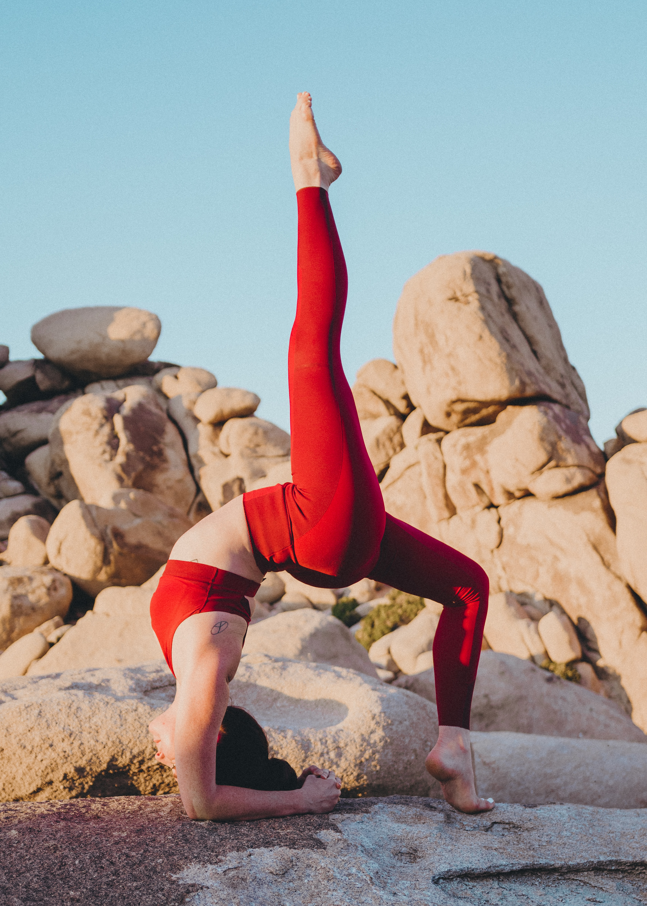

If you had asked me my opinion of yoga 3 years ago, I would most probably have told you that its a waste of time, not intense enough, too slow or I'd even have called it easy (sorry yogi's)! Crazy, I know. I just didn't want to swap an intense, sweaty session for what I saw as, a glorified stretching class. 

Don't worry though. I've seen sense now and I'm a huge yoga fan (still not quite sure if I qualify as a yogi though). 

Those of you who know me know that I used to be a runner. As a runner, I had no real knowledge of stretching or yoga and so, as you can imagine, the more I trained, the tighter my muscles got. You can probably imagine where that got me. That's right: Injury. It started as a plantar fascia injury and went from there, to shin splints and pulled muscles and back to shin splints again. Did I listen to my body and stop training? No, of course not. I continued running on my injured foot, causing what seemed like endless injuries. 

It was after about 3 rounds of shin splints that I decided to stop running. And, whilst I'm not saying that it could have been 100% preventable, stretching my muscles before and after running would have definitely helped in preventing injury and allowing full recovery. It was muscle tightness that put a strain on my body and didn't allow for a full range of motion.

From when I stopped running in 2017, to the beginning of lockdown, I never really trained my flexibility regularly. It was only when I started doing weekly yoga where I saw steep improvements. From an increased range of motion to higher ability in my workouts and an overall more healthy feeling in myself. If such improvements could be made in a couple of yoga sessions, just how beneficial could more yoga be, to me or others?

What also shocked me was how hard yoga could be. I could do barely any of the poses (I would consider myself quite active) and got pretty tired and sweaty after half an hour. This really shocked me. If you'd have watched the first few classes I did, you would have seen it could have been a comedy act. I'd lift my leg up for a 3-legged dog and fall flat on my face, or in a forward fold (bearing in mind you're meant to be aiming for the floor), I'd just about reach a 90-degree angle from my torso. Let's just say I'm not a natural yogi.

Having been doing yoga for around 5-6 months now, I've seen so much improvement and most of the moves are manageable. It's still tiring, but worth it! Okay, yeah, fine, it would most definitely still be entertaining to watch, just now it's my failure at a standing split, crow pose or even a side crow pose (honestly if anyone has any tips for how to do this please let me know because from where I am it seems absolutely impossible). 

Enough of me chatting, time to try and persuade you to start yoga.

## Benefits of yoga

* Increased flexibility
* Improved muscle tone
* Improved energy & respiration
* Improved athletic performance
* Increased athletic ability
* Protection from injury
* Decreased stress & anxiety

These benefits don't even scratch the surface of what yoga can do for you. As one of yogas biggest sceptics a few years ago, I was shocked by the magic of yoga after just a few classes. Now, I do yoga at least once a week and look forward to it. 

At the end of most yoga sessions, there is a Shirvasana: 5-10 minutes of relaxation and mindfulness. Just enough time to rest, refresh and restart your day!

We all know the benefits of mindfulness and meditation. Decrease your stress and anxiety, clear your head, help you sleep better etc etc etc. I've tried to meditate regularly and failed because I can't seem to find the time to lay down on my bed and do nothing. As an active and semi-extroverted person, it is a challenge for me to sit still and just think (or try not to think). This is where yoga works for me. I still get the downtime to clear my head, except I get to move around and use my muscles at the same time.

So, the take-homes of today's post:

* I have a recent love for yoga
* You (and I) need to do more yoga
* Yoga is NOT EASY
* There are so many benefits to yoga, its hard to find a reason not to do it.

If you're interested in doing yoga, but don't know where to start, the app that I use is called DownDog. You can select all sorts of yoga styles, areas of your body to focus on, strength or flexibility, the amount of relaxation at the end, the music choice and the instructor. 

I love the amount of freedom that the app gives you, and is definitely worth the small subscription. (this isn't an ad or anything, I just love the app and it's got me through lockdown)

I hope you guys enjoyed this post, sorry it's been a while! Hopefully, I'll get another post out soon :)