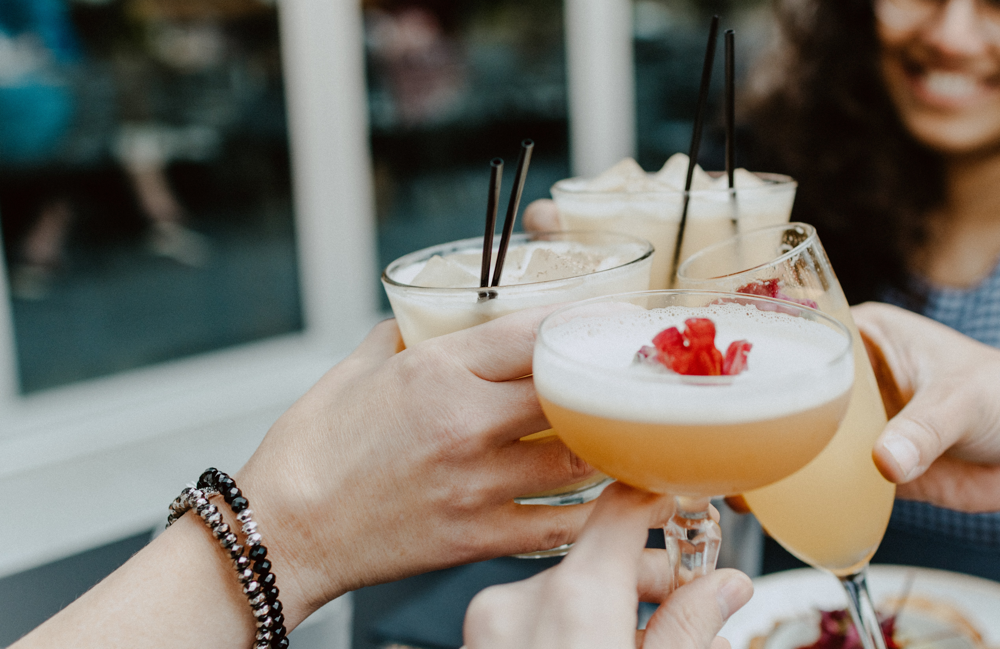

Welcome to my uni series! There's going to be at least 3 posts in this series including healthy uni meals, workouts and how to socialise whilst staying on track with your fitness goals.  So, for my first blog post back in Birmingham, I'm going to do some quick tips for achieving your health goals whilst being a student.

It's almost October and most of us students are back at university, ready to get back into student life. Whether you're a fresher or a final year, I always find it a struggle to get into the swing of cooking and food shopping. If, like me, you also enjoy staying healthy, its hard to find a balance between eating healthily and enjoying student life. 

## Tip 1: Eat Regularly

One of the things that I am worst at when I'm at uni is having regular meals. I just feel like, when I'm only cooking for myself, I have no-one else to cook for and so I tend to eat very snacky meals. Personally, I've found that the best way for me is to eat two meals a day and plenty of snacks in between! I would never get around to eating healthily three times a day, so I focus on the two meals being healthy. It's then easier to have simple snacks alongside this. 

Don't get me wrong, I'm not saying that having two meals a day is what will work for everyone.  What I'm trying to say is that make sure that you find a pattern. I tend to eat at 11-12 in the morning and then at around 6-7 in the evening. Between this time, its snack, snack, snack. From fruit to nuts, hummus and carrots, cereal bars, crisps and toast, I find it best to eat intuitively between my meals (post coming soon). As long as I only eat when I'm hungry, I  find that I'm more than ready for dinner and am excited to cook! Your pattern could be four healthy meals a day and no snacks or maybe a traditional three meals a day. Just try to keep it as structured as possible!

## Tip 2: Plan, Plan, Plan

Right I'm going to be honest from the start here. I always intend to plan, but it doesn't always go the way I want it to. My plans often change and I don't always have time to plan my meals for the week. However, it's an important step in keeping healthy, and it's my resolution this semester. Take a day of the week, one evening and plan the next week. It doesn't have to be a rigid schedule, in fact, it can be completely flexible, but a basic plan is so useful.  

The times when I have kept more with my plans are when I'm extremely flexible, and that's my aim this year. Just taking a few dinner recipes each week, a few snack ideas and a couple of breakfasts and you can rotate them over the week. If I'm cooking, I usually make at least 2 portions (mainly so that I don't have to cook as much) and then eat it a few times each week. I don't plan the days, just the meals and their ingredients. That way, if you don't fancy one meal that day, you can make the other. Also, planning and rotating meals decrease your weekly shopping bill, as you only buy what you need at the start of the week. What student doesn't want to eat cheaply, right? 

## Tip 3: Moderation

One key thing to remember is that university should be an enjoyable experience. Give yourself a break. This could be in regards to food, snacks, alcohol or workouts...or even uni work. Just because you're staying healthy, doesn't mean you can't go out and socialise. You may be aware that alcohol is very high in calories. Although this is the case, and large amounts of alcohol will inhibit your healthy lifestyle, if you enjoy drinking, just drink in moderation. 

This is the same with everything. If you're craving crisps or chocolate, then go ahead and eat it. Just try to eat a small amount, or have it as a treat. When your house are having a pizza night, go ahead. Where you can, eat nutritious food, but don't punish yourself for not being 100% healthy. One pizza isn't going to sidetrack your health, a couple of glasses of wine aren't going to kill you and skipping a workout is not the end of the day.  Take each day as it comes and do your best. Any change is better than no change! It's a mindset of moderation and not restriction which is the most sustainable and successful!