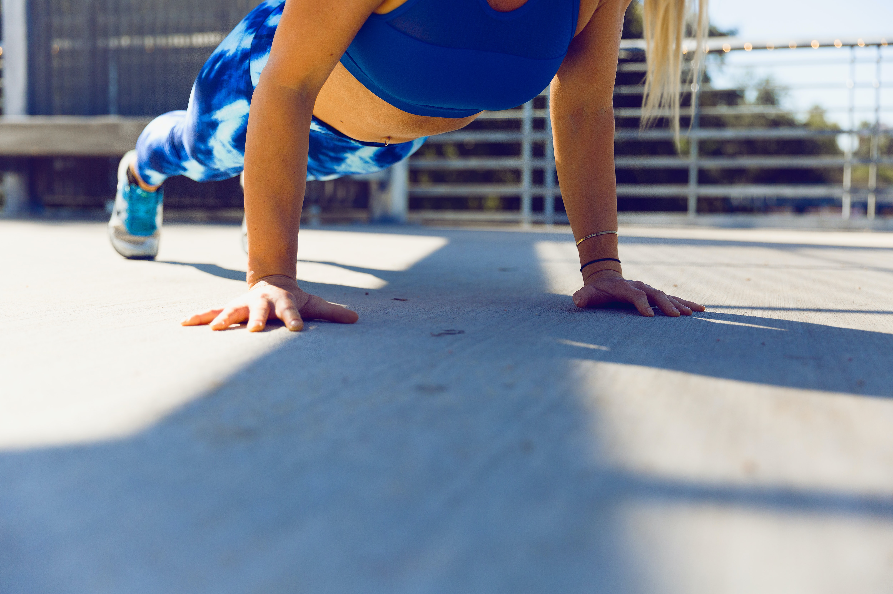
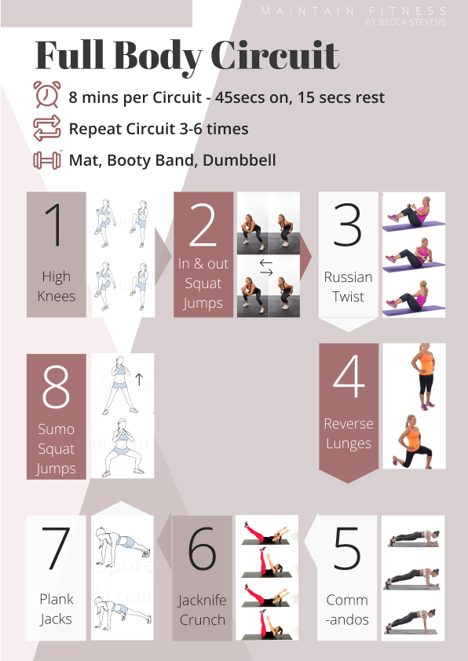

It's looking increasingly likely that within the next few weeks, every town in the UK will be in some form of local lockdown. Whilst we don't yet know what that may be, it's likely that there will be times in the upcoming weeks where we may not be able to go to gyms. Our fitness routines will have to be run from home once more. Whether you found your healthier self in lockdown 1 or you really struggled to motivate yourself, I'm hoping that my tips below will help to you find a way of working out from home that suits you!

## Find A Separate Space

Throughout the last lockdown, I worked out predominantly outside to enjoy the nice weather and find a new space (but mostly for the tan). This time around, its winter. It's probably going to be a great deal harder to motivate yourself to get out of your warm bed and enter the freezing cold garden. Indoor home workouts might takeover in the next few weeks.

With the outside looking like less of an option, no matter how small your house or flat is, try to find a space, separate from where you sleep, to exercise. Preferably, this could be a separate place in the house/flat or outside, but if not, you could use a separate area of your room. Sleeping on your bed, studying on your bed and working out next to your bed is not a great combination. It's important for your mental wellbeing that you change things up. So even if its placing a yoga mat on the floor or designating an area of your house/room to workouts, try to make a separate area for exercise. 

I find that the best way for me is to place a mat down, clear the floor, put some upbeat music on and get into the zone. By no means is it the same as the gym, but it works (especially if you don't want to brave the cold outside). 

## Use what you have

If you follow any fitness influencers on social media, you have probably seen the most creative ideas for replacement weights in workouts. If not, think weird and wacky. I saw cans of beans for dumbbells, huge cartons of water, pints of milk, boxes full of books and people lifting sofas. When fitness fanatics are deprived of heavy weights, it shows how creative we can be. This is great. You don't need loads of high-tech equipment to have an effective workout. In fact, I'd say that you can have an amazing session with household items alone.

Don't get me wrong, if your goal is to gain loads of muscle or become super strong, home workouts with minimal equipment are not ideal for you. However, if you're exercising for health, fitness and a little bit of toning, you can get all you need from home. Get creative!

When I'm doing home-workouts, I tend to focus on high-intensity workouts. Circuits, AMRAP, Supersets and 1000 rep challenges are all methods that I use to keep the sweat on and make the session count. If you don't have the weights available, increase the repetitions and use your body weight to your advantage. For example, focus on single-sided exercises such as single-leg squats, deadlifts, single-arm rows or complete push-ups, press-ups and burpees. All of these exercises need little to no weight, as they use your own body weight to challenge yourself!

## Have a routine

This is a great tip for anyone in lockdown. In lockdown 1, you probably saw "creating a routine" tips on social media. I saw pretty sheets of paper, laid out in the most aesthetic way, planning your life to the second. They take hours to make, most of the time creating the layout and design (procrastination level 100) and they are relatively hard to stick to. 

This detailed planning will probably work for some of you (ignore this next bit if that's you), but for others, I included, it's way too hard to stick to. Then, once you break it, you write off the day (or is that just me?). Either way, I prefer to have a rough guideline of the day. My time for working out is in the morning and if I don't exercise as soon as I wake up, I will not get round to it. For other people, afternoons or evenings work better. 

So, once you've decided your workout time slot, create a to-do list. My workout is the only timed element of my day. Everything else fits around it. Ensure that you still have structure and tasks to get done, big or small. It's so important, for your mental health, that you know what your day holds and you know what you want to accomplish. 

## Balance your \*Diet\*

\*I want to highlight that the definition of "Diet" is "the kinds of food that a person, animal, or community habitually eats"

Food was probably one of the things that got me through the previous lockdown. At home, we each took it in turns to cook one meal each week, and we rated everyone's meal. We ended up having some pretty amazing meals and we had to end it when we all started getting too competitive and were making three-course meals every day. It was a bit too much...

Even though I was eating some pretty amazing meals, throughout the last lockdown I stayed super healthy and fit. In fact, probably the healthiest I have been in about two years. I wasn't restricting myself, I was eating crisps, chocolate and dessert, just all in moderation. The best way to get healthier is balance. Eat healthy meals, unhealthy meals and snack when you're, just try not to overindulge. After all, one chocolate bar won't affect your health, it's the three that you have after that because *"you've already been unhealthy today"*!

Try to plan your meals. Knowing what your meals will be for the week can really help you in your healthy lifestyle. If you know that you're going to be having healthy dinners, you can allow yourself that slice of cake or takeaway on one night of the week!

So, what I'm trying to say is that, in a time where the world is very different to what we're used to, food can bring us together and be an important part of the day. Where you can, eat healthily but don't pressure yourself to be perfect. For some people, you may be your healthiest self during this pandemic, but for others, it is a huge struggle. Don't let a struggle with food add to your stresses as well.

I hope that you enjoyed this blog post. Below is a snippet from my home workout guide that I'm currently selling. Send me an email for details!

Stay positive over the next few months and let's try to make the most out of a less than ideal situation!